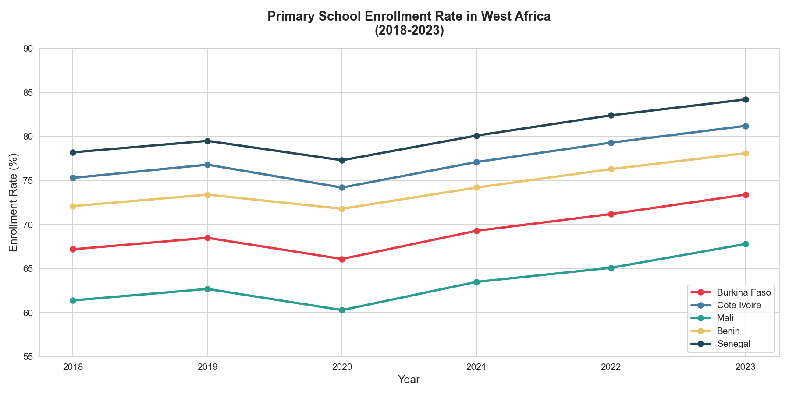
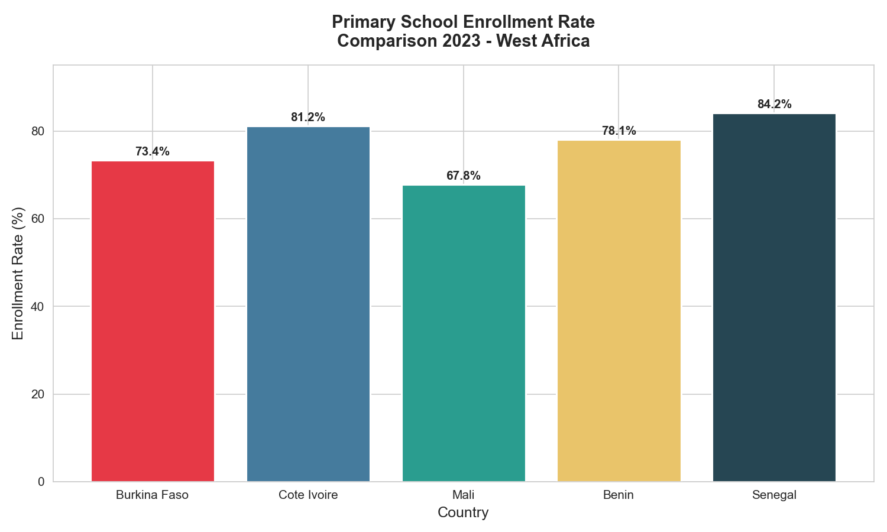
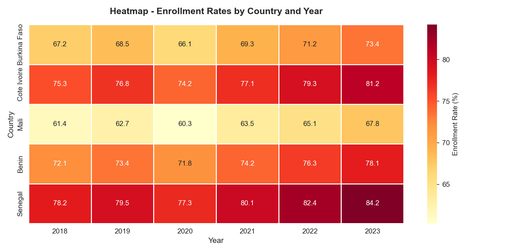

# -*- coding: utf-8 -*-
"""
Created on Sun Jun  7 22:54:56 2026

@author: loyea
"""
# West Africa Education Data Analysis 📊

## Overview
This project analyzes primary school enrollment rates 
across five West African countries 
(Burkina Faso, Côte d'Ivoire, Mali, Bénin, Sénégal) 
from 2018 to 2023.

## Author
**Bezo Franck Darel Salomon Kienou**
- Applied Mathematics Student — Université Thomas Sankara
- Country Commercial Director — Schoolap (West Africa)

## Motivation
As Country Commercial Director at Schoolap, 
an educational management software company operating 
across Burkina Faso, Côte d'Ivoire, Bénin and Mali, 
I work daily with educational performance data. 
This project reflects my commitment to using 
data analysis to understand and improve 
educational outcomes in West Africa.

## Tools & Libraries
- Python 3.11
- Pandas — data manipulation
- Matplotlib — data visualization
- Seaborn — statistical graphics

## Key Findings
- All 5 countries show consistent improvement 
  between 2018 and 2023
- Sénégal leads with 84.2% enrollment in 2023
- Mali shows the strongest growth momentum
- Burkina Faso progressed from 67.2% to 73.4%

## Visualizations
### 1. Enrollment Evolution (2018–2023)

### 2. Country Comparison 2023

### 3. Heatmap by Country and Year

## Data Source
Inspired by UNICEF and World Bank 
open educational datasets for West Africa.

## Connect
- LinkedIn : [Bezo Franck Darel Salomon Kienou]
- Email : [Ton email]